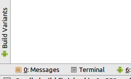

# Add CDep Dependencies to an Existing Android Studio CMake Project
This tutorial will show you how to add the first CDep dependency to an existing Android Studio project.
If you'd rather just see a finished example of this then check out [CDep Freetype Sample](https://github.com/jomof/cdep-android-studio-freetype-sample).

## Setup
This step creates a new Android Studio CMake project to use in this tutorial. If you already have a project to use then you can skip it.

Follow these steps:
1. Start Android Studio 2.2 or later
2. File->New->New project...
3. Click Include C++ Support checkbox
4. Next, next
5. Choose Empty Activity
6. Next, next, finish

## Step 1 -- Add CDep tool to the root of the project
At this point you should have a project open in Android Studio. Open a terminal window by clicking Terminal. It is usually in the lower part of Android Studio.

